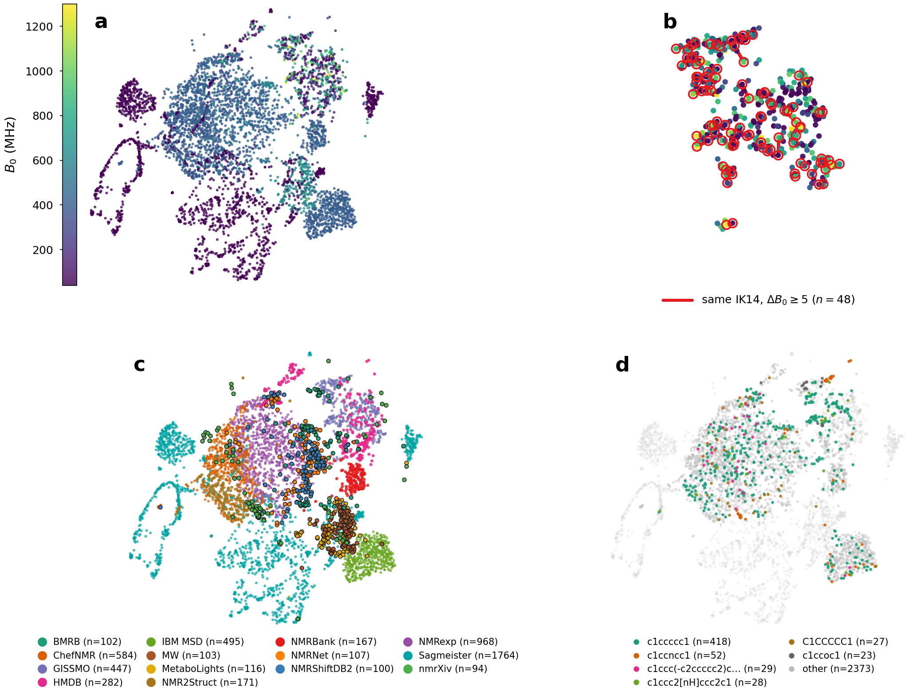

# ROSE-1H NMR

[](https://doi.org/10.26434/chemrxiv.15007823/v1)
[](https://doi.org/10.5281/zenodo.22142631)
[](https://huggingface.co/romboai/rose-1h-nmr)
[](LICENSE)

Pretrained **¹H NMR** foundation model — inference and paper adaptation protocols.

**Paper:** [ChemRxiv](https://doi.org/10.26434/chemrxiv.15007823/v1).
**Archive:** [Zenodo](https://doi.org/10.5281/zenodo.22142631) (all versions; v0.2.0 is [10.5281/zenodo.23260453](https://doi.org/10.5281/zenodo.23260453); v0.1.0 is [10.5281/zenodo.22142632](https://doi.org/10.5281/zenodo.22142632)).
**Weights:** [`romboai/rose-1h-nmr`](https://huggingface.co/romboai/rose-1h-nmr).
**Code:** this repo.

<p align="center">
  
</p>

<p align="center"><em>Frozen [CLS] embeddings (UMAP). Stratified subsample, n=5500 over 14 source families.</em></p>

## Quick start

```bash
git clone https://github.com/romboai/rose-1h-nmr.git
cd rose-1h-nmr && pip install -e ".[hub]"
```

```python
from rose import load, encode
model = load()
z = encode(model, spectrum)  # float32, shape (4096,), linear 0–14 ppm
```

Input may also be `(B, 4096)`. `field_mhz` and `solvent_id` are optional (`solvent_id` → `configs/solvent_vocab.json`). Local weights: `load("path/to/best_model.pt")`.

```python
import numpy as np
from rose import load, encode, predict

model = load()
spectrum = np.load("spectrum.npy")     # (4096,)
z = encode(model, spectrum, field_mhz=400.0, solvent_id=3)  # cdcl3 → (B, 256)
```

## Task heads

```python
import numpy as np
from rose import load, predict

model = load()
spectrum = np.load("spectrum.npy")
noisy = spectrum + 0.01 * np.random.randn(*spectrum.shape).astype(np.float32)

# denoise — clean spectrum from noisy input (zero-shot)
clean = predict(model, noisy, task="denoise")
# (B, 4096)

# peak — peak probability per grid point
probs = predict(model, spectrum, task="peak")
# (B, 4096) in [0, 1]

# retrieval — contrastive spectrum ↔ SMILES (one SMILES per spectrum)
out = predict(model, spectrum, task="retrieval", smiles="CCO")
# logits_per_spec (B, B), logits_per_struct (B, B), loss

# forward — ¹H shifts from structure (SMILES; spectrum sets batch size)
out = predict(model, spectrum, task="forward", smiles="CCO")
# shifts_pred (B, 32), count_pred (B,)

# pair — similarity of aligned spectrum pairs (spectrum[i] ↔ spectrum_b[i])
out = predict(model, spectrum, task="pair", spectrum_b=spectrum)
# similarity (B,), logits (B, B)
```

## Fine-tuning

Zero-shot uses pretrained weights as-is. For adaptation, load with `eval_mode=False`, then `adapt` + `param_groups`:

- `freeze_encoder` (alias `P1`) — train task head only; easy domains
- `unfreeze_encoder` (alias `P2`) — train encoders + head; hard domains

**P1 — peak (frozen encoder)**

```python
import numpy as np
import torch
import torch.nn.functional as F
from rose import load
from rose.grid import ppm_axis_tensor

model = load("best_model.pt", eval_mode=False)
model.adapt(mode="freeze_encoder", task="peak")
model.print_trainable_parameters()
opt = torch.optim.Adam(model.param_groups())  # lr_head=1e-3

device = next(model.parameters()).device
spectrum = torch.from_numpy(np.load("spectrum.npy")).unsqueeze(0).to(device)
ppm = ppm_axis_tensor(spectrum.size(0), device=device, cfg=model.cfg)
peak_labels = torch.zeros_like(spectrum)  # (1, 4096) in [0, 1]

logits = model.run_task("peak", spectrum=spectrum, ppm_axis=ppm)
loss = F.binary_cross_entropy_with_logits(logits, peak_labels)
loss.backward()
opt.step()
```

**P2 — retrieval (unfreeze encoder)**

```python
import numpy as np
import torch
from rose import load, smiles_batch
from rose.grid import ppm_axis_tensor

model = load("best_model.pt", eval_mode=False)
model.adapt(mode="unfreeze_encoder", task="retrieval")
model.print_trainable_parameters()
opt = torch.optim.Adam(model.param_groups())  # lr_head=1e-3, lr_encoder=1e-5

# contrastive loss needs batch size ≥ 2
device = next(model.parameters()).device
spectrum = torch.from_numpy(
    np.stack([np.load("spectrum_a.npy"), np.load("spectrum_b.npy")])
).to(device)
ppm = ppm_axis_tensor(spectrum.size(0), device=device, cfg=model.cfg)
mol = smiles_batch(["CCO", "c1ccccc1"]).to(device)

out = model.run_task("retrieval", spectrum=spectrum, ppm_axis=ppm, mol_batch=mol)
loss = out["loss"]
loss.backward()
opt.step()
```

## Results

Numbers from the paper (ROSE-Pretrain-L, 7.8M parameters, 3.2M pretrain spectra, InChIKey-14 holdout).

**Internal** — native heads on the held-out test, no adaptation:

| Task | Metric | Gallery | ROSE |
|------|--------|---------|------|
| Denoise | ΔSNR_peak @ 10 dB / cosine | — | 16.3 / 0.95 |
| Pair | Top-1 | 3,362 | 78.0% |
| Retrieval | Top-1 | 14,323 | 64.3% |
| Forward | Chamfer (+ count) ↓ | — | 0.42 |
| Peak | F1 @ 0.05 ppm | — | 0.83 |

Pair and retrieval Top-1 are against that gallery. On the low-field slice (B₀ ≤ 100 MHz) pair is 63.4% (gallery 1,745) and retrieval is 21.9% (gallery 1,506). Peak F1 is 0.20. Denoise cosine is 0.99.

**External**

| Benchmark | Protocol | Metric | ROSE | Same-protocol baseline |
|-----------|----------|--------|------|------------------------|
| QIB edible oils (60 MHz) | frozen encoder + linear head | 5-fold accuracy | 99.3% ± 0.9% | 98.9% PLS-DA (published accuracy) |
| NMRNet structure→spectrum | frozen structure encoder + forward head | Chamfer ↓ | 0.783 ± 0.009 | 1.29 Morgan+Ridge |
| NMRformer peak detection | frozen encoder + peak head, 5-fold | F1 | 0.64 ± 0.11 | 0.68 ± 0.09 find_peaks |
| NMR-Solver (Zenodo) retrieval | 5-epoch stage, gallery ≈30k | Top-1 / Top-10 | 46.8% ± 0.7% / 74.9% ± 1.0% | peak-list match, 0% Top-1 |

QIB balanced accuracy on the same folds is 99.5% ± 0.6%. PLS-DA balanced accuracy is 99.3% ± 0.6%. The Zenodo baseline compares an experimental peak list with simulated sticks in 0.05 ppm bins. NMR-Solver as published uses a gallery of about 10⁸, FAISS HNSW, and a set-similarity rerank: ¹H without formula is 0.67% / 3.78% Top-1 / Top-10; ¹H+¹³C with formula is 52.9% / 67.3%.

Weights: Hugging Face [`romboai/rose-1h-nmr`](https://huggingface.co/romboai/rose-1h-nmr).

## Citation

```bibtex
@article{diiorio2026rose,
  title   = {{ROSE}: a Foundation Model for Reusable One-dimensional
             Spectrum Embeddings in $^1$H~{NMR}},
  author  = {Di Iorio, Mattia and Mattia, Carmine and Zanda, Andrea
             and Atzori, Maurizio},
  year    = {2026},
  journal = {ChemRxiv},
  doi     = {10.26434/chemrxiv.15007823/v1},
  url     = {https://doi.org/10.26434/chemrxiv.15007823/v1},
  note    = {Preprint}
}
```

## Data

**Recipes only — no pretraining parquet.** Reconstruct ROSE-Pretrain-L from the cited sources (`ATTRIBUTION.md`) with the paper holdout and split policy. This repo ships:

- holdout **H** as InChIKey-14 keys (`indices/holdout/`)
- split IDs and policy (`indices/pretrain/pretrain_l_splits.json`, `pretrain_l_splits.meta.json`)
- literature eval ID lists (`indices/benchmarks/`)

Spectra stay with the original distributors. Weights are on Hugging Face, not a data dump.

## Repository layout

| Path | Role |
|------|------|
| `docs/` | README figure (encoder UMAP) |
| `src/rose/` | Library — model, encoders, API, task heads |
| `configs/` | `rose.yaml`, `solvent_vocab.json` |
| `hub/` | Hugging Face metadata (`config.json`) |
| `scripts/` | Maintainer utilities (HF upload staging) |
| `indices/pretrain/` | Pretrain split IDs and policy (`pretrain_l_splits.json`, `pretrain_l_splits.meta.json`) |
| `indices/holdout/` | Paper test holdout (IK14), excluded from pretrain |
| `indices/benchmarks/` | Eval splits (NMRBank, NMR-Solver) and literature holdouts |

Indices hold **IDs only** (no spectra). Each `.meta.json` documents format and split policy.

## License

Code and pretrained weights: [Apache-2.0](LICENSE). See [`NOTICE`](NOTICE).

Training and evaluation **spectra are not in this repository**. Source names, licenses, and citations: [`ATTRIBUTION.md`](ATTRIBUTION.md).
